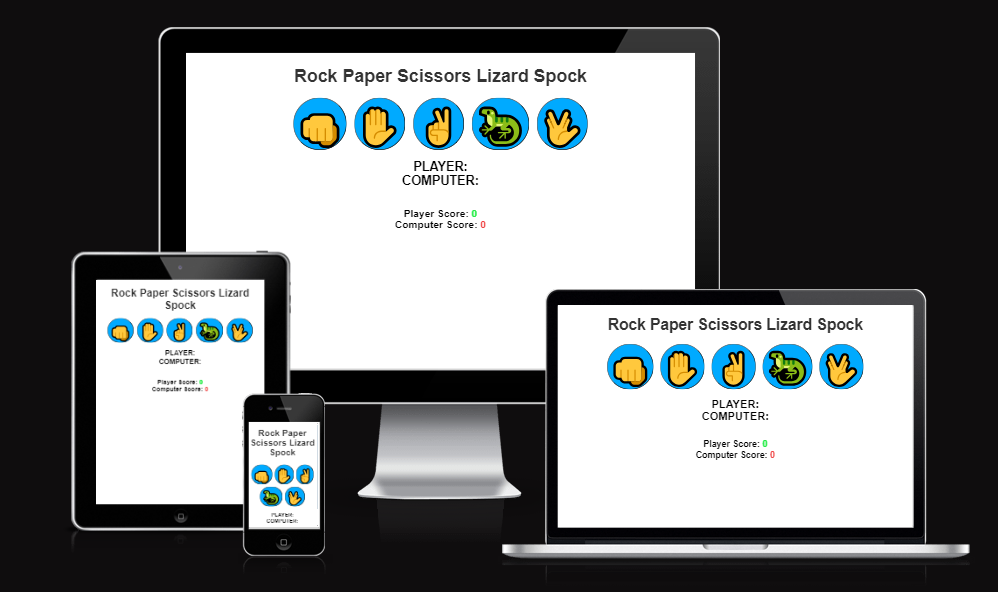

# Rock Paper Scissors Lizard Spock

This is a **Rock Paper Scissors Lizard Spock** game, a fun twist on the classic game of Rock Paper Scissors. It adds additional moves—Lizard and Spock—which increase the game's complexity. The game is played in the browser and features a user-friendly interface with large buttons, animated feedback, and a score tracker to show the player and computer scores.



## Table of Contents

1. [Project Overview](#project-overview)
2. [Features](#features)
3. [Technologies Used](#technologies-used)
4. [How to Play](#how-to-play)
5. [Code Structure](#code-structure)


---

## Project Overview

The **Rock Paper Scissors Lizard Spock** game is a web-based interactive game built with HTML, CSS, and JavaScript. This expanded version of the classic game increases complexity and excitement by adding two additional moves. It is designed to be easy to play and responsive across different screen sizes.

### Key Highlights:
- **Expanded Gameplay**: Adds “Lizard” and “Spock” moves to the traditional Rock-Paper-Scissors game.
- **User Feedback**: The interface provides instant feedback on the results of each round.
- **Score Tracking**: Real-time score tracking for both player and computer.
- **Responsive Design**: Optimized for both desktop and mobile devices.

---

## Features

### 1. Game Interface
- Large, accessible buttons for each choice: **Rock**, **Paper**, **Scissors**, **Lizard**, and **Spock**.
- Icons are used to make each choice visually appealing and easy to select.
- Responsive layout adapts to various screen sizes.

### 2. Score Display
- Displays the current score for both the **Player** and the **Computer**.
- Winning scores are highlighted with different colors to distinguish between a win and a loss.

### 3. Real-Time Results
- The game updates with each round, showing the player’s and computer’s choices.
- Immediate feedback appears in a large text display showing if the player won, lost, or tied the round.

---

## Technologies Used

- **HTML5**: The structure of the game and interactive elements.
- **CSS3**: Styling for the layout, including responsive adjustments.
- **JavaScript**: Core game logic, DOM manipulation, and score tracking.

---

## How to Play

1. **Select a Move**: Choose one of the five options: **Rock**, **Paper**, **Scissors**, **Lizard**, or **Spock** by clicking the corresponding button.
2. **Game Result**: The computer randomly picks a move, and the result is displayed along with each player's choices.
3. **Score Update**: The game updates the score based on the outcome:
   - **Rock** crushes **Scissors** and **Lizard**
   - **Paper** covers **Rock** and disproves **Spock**
   - **Scissors** cuts **Paper** and decapitates **Lizard**
   - **Lizard** eats **Paper** and poisons **Spock**
   - **Spock** smashes **Scissors** and vaporizes **Rock**
4. **Winning/Losing Feedback**: The result display changes color based on the game outcome: green for a win, red for a loss.

---

## Code Structure

```plaintext
rock-paper-scissors-lizard-spock/
│
├── index.html               # Main HTML structure for the game
├── assets/
│   ├── css/
│   │   └── style.css        # Main CSS file for styling the game interface
│   └── images/              # Folder for images/icons (optional)
└── index.js                 # JavaScript file containing game logic
